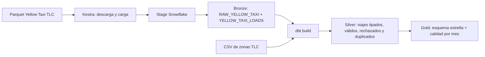
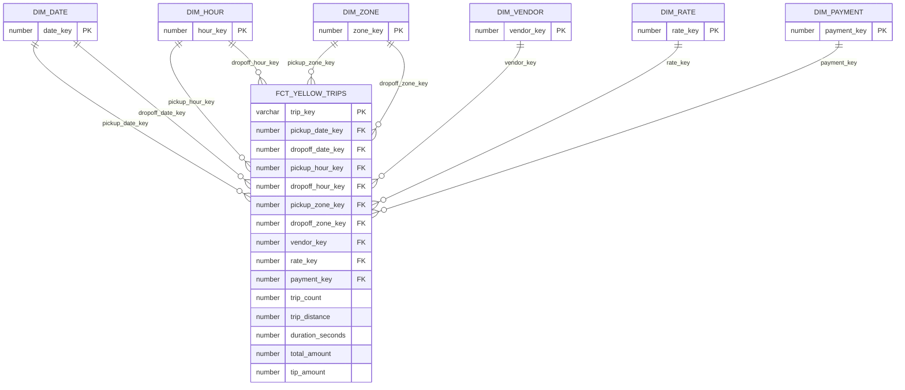

# Arquitectura

```mermaid
flowchart LR
    TLC[Parquet Yellow Taxi TLC] --> K[Kestra: descarga y carga]
    K --> ST[Stage Snowflake]
    ST --> BR[Bronze: RAW_YELLOW_TAXI + YELLOW_TAXI_LOADS]
    BR --> DBT[dbt build]
    DBT --> SI[Silver: viajes tipados, válidos, rechazados y duplicados]
    SI --> GO[Gold: esquema estrella + calidad por mes]
    Z[CSV de zonas TLC] --> DBT
```

# Esquema estrella

```mermaid
erDiagram
    DIM_DATE ||--o{ FCT_YELLOW_TRIPS : pickup_date_key
    DIM_DATE ||--o{ FCT_YELLOW_TRIPS : dropoff_date_key
    DIM_HOUR ||--o{ FCT_YELLOW_TRIPS : pickup_hour_key
    DIM_HOUR ||--o{ FCT_YELLOW_TRIPS : dropoff_hour_key
    DIM_ZONE ||--o{ FCT_YELLOW_TRIPS : pickup_zone_key
    DIM_ZONE ||--o{ FCT_YELLOW_TRIPS : dropoff_zone_key
    DIM_VENDOR ||--o{ FCT_YELLOW_TRIPS : vendor_key
    DIM_RATE ||--o{ FCT_YELLOW_TRIPS : rate_key
    DIM_PAYMENT ||--o{ FCT_YELLOW_TRIPS : payment_key
    FCT_YELLOW_TRIPS {
        varchar trip_key PK
        number pickup_date_key FK
        number dropoff_date_key FK
        number pickup_hour_key FK
        number dropoff_hour_key FK
        number pickup_zone_key FK
        number dropoff_zone_key FK
        number vendor_key FK
        number rate_key FK
        number payment_key FK
        number trip_count
        number trip_distance
        number duration_seconds
        number total_amount
        number tip_amount
    }
    DIM_DATE { number date_key PK }
    DIM_HOUR { number hour_key PK }
    DIM_ZONE { number zone_key PK }
    DIM_VENDOR { number vendor_key PK }
    DIM_RATE { number rate_key PK }
    DIM_PAYMENT { number payment_key PK }
```
